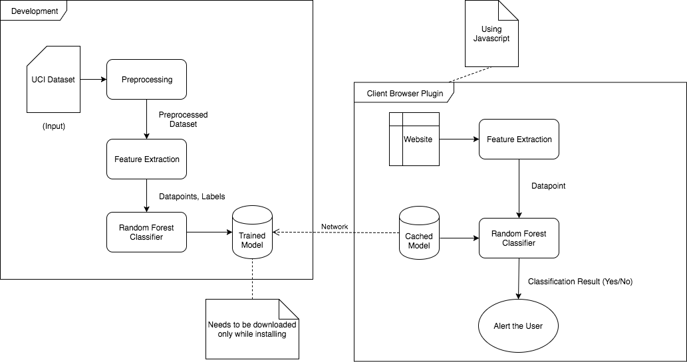

<h1>Phish Catcher 🛡️</h1>
<h2>Real-Time Phishing Detection Chrome Extension</h2>

<em>Using Random Forest & XGBoost machine learning models to identify phishing websites</em>

<h2>Overview</h2>

Phish Catcher is a Chrome extension designed to make browsing safer by detecting phishing websites in real-time. It uses trained machine learning models (Random Forest & XGBoost) to classify websites as <strong>safe</strong> or <strong>malicious</strong>, and alerts the user instantly.

<h2>Features</h2>
<ul>
    <li>Real-time detection of phishing websites</li>
    <li>Machine learning inference runs locally (no server required)</li>
    <li>Lightweight and user-friendly Chrome extension</li>
    <li>Includes dataset and trained models for demonstration</li>
</ul>

<h2>Project Structure</h2>
<pre>
📦 phishing-detection-chrome-extension
├── ChromeExtension/
│   ├── artifacts/ (diagrams, screenshots, files)
│   ├── backend/ (feature extraction & ML scripts)
│   └── frontend/ (Chrome extension files: HTML, JS, CSS)
├── Dataset/ (phishing URL datasets)
├── model/ (trained Random Forest & XGBoost models)
├── requirements.txt
├── run.bat
├── test.py
└── Main.py
</pre>

<h2>Tech Stack</h2>
<ul>
    <li><strong>Python</strong> – Feature extraction & machine learning</li>
    <li><strong>Scikit-learn & XGBoost</strong> – ML models</li>
    <li><strong>Chrome Extension</strong> – HTML, JavaScript, CSS</li>
</ul>

<h2>Installation</h2>
<h3>1) Clone the project</h3>
<pre>git clone https://github.com/Abdulwahid84/phishing-detection-chrome-extension.git
cd phishing-detection-chrome-extension</pre>

<h3>2) Install dependencies</h3>
<pre>pip install -r requirements.txt</pre>

<h3>3) Load the extension in Chrome</h3>
<ol>
    <li>Open <code>chrome://extensions/</code></li>
    <li>Enable <strong>Developer mode</strong></li>
    <li>Click <strong>Load unpacked</strong></li>
    <li>Select <code>ChromeExtension/frontend/</code></li>
</ol>

<h2>How It Works</h2>

<ol>
    <li>User visits a website</li>
    <li>Extension extracts URL features</li>
    <li>Features are passed into trained <strong>Random Forest</strong> & <strong>XGBoost</strong> models</li>
    <li>Models predict whether the website is <strong>safe</strong> or <strong>phishing</strong></li>
    <li>User receives an alert if the site is suspicious</li>
</ol>

<h2>Trained Models</h2>

The trained machine learning models are stored in the <code>model/</code> folder:

<ul>
    <li>Random Forest → <code>rf.txt</code></li>
    <li>XGBoost → <code>xgb.txt</code></li>
    <li>Optional: SVM → <code>svm.txt</code></li>
</ul>

You can retrain or update these models using the scripts in <code>ChromeExtension/backend/classifier/</code>.

<h2>Example Results</h2>
<table>
    <tr>
        <th>Model</th>
        <th>Accuracy</th>
    </tr>
    <tr>
        <td>Random Forest</td>
        <td>0.93</td>
    </tr>
    <tr>
        <td>XGBoost</td>
        <td>0.96</td>
    </tr>
</table>

<em>(Replace with your actual test results if available.)</em>

<h2>Dataset</h2>

Phishing URL datasets are in the <code>Dataset/</code> folder:

<ul>
    <li>phish_tank_storm.csv</li>
    <li>testData.csv</li>
</ul>

These are used for training and testing the models.

<h2>Usage</h2>

Once loaded, Phish Catcher will automatically analyze the websites you visit. If a URL is suspicious, the extension alerts you instantly.

<h2>Contributing</h2>

Contributions are welcome! Fork the repo, make your changes, and submit a pull request.

